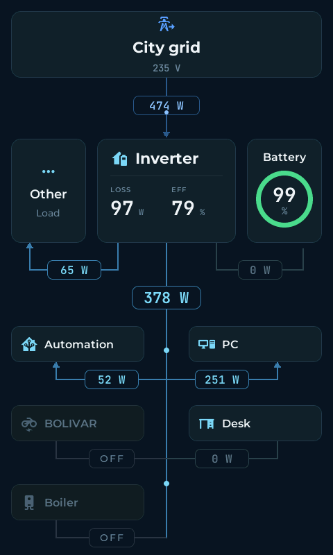
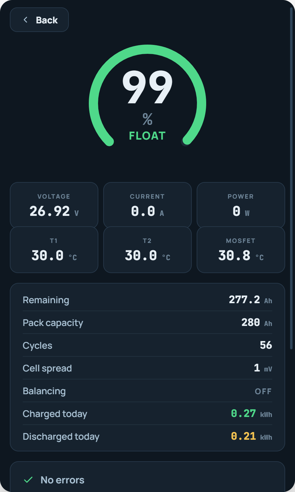
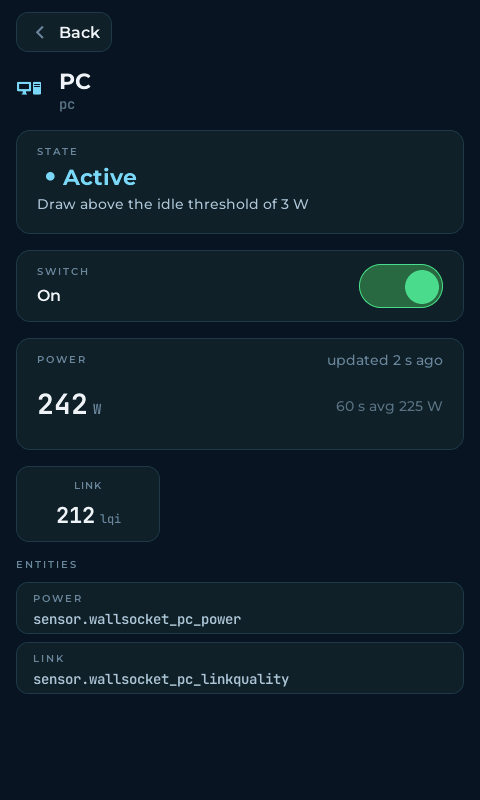
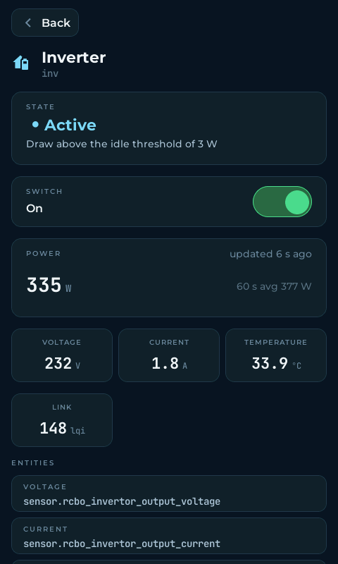

# esphome_power_flow

An ESPHome external component that turns a touch panel (initially: Guition
JC4880P443, ESP32-P4, 480 × 800) into a live diagram of a home electrical
installation: an animated power-flow screen, a battery
screen, and a detail screen for whichever node was tapped. Everything is read
from Home Assistant; the panel measures nothing itself.

<p>
  
  
  
  
</p>

*Live screenshots from the panel, not mockups.*

- The YAML stays declarative — entities, names, icons, fonts. Geometry,
  colours, arithmetic and animation live in C++.
- Per node, the balance solves for exactly one unmetered edge (`power: auto`);
  a second unknown is rejected at compile time.
- A value whose validity condition is unmet shows **a dash, never an
  estimate** — no quietly wrong numbers on a wall.
- Nodes with a `control:` switch get a working toggle on their detail screen.

Tied to nothing about that panel except the screen size. Developed and tested
against ESPHome 2026.8.

## Install

```yaml
external_components:
  - source: github://stalexteam/esphome_power_flow@v1.0.4
    components: [power_flow]
```

Reference a tag rather than a branch: a branch means the firmware you build
next month may not be the firmware you built today, and on a wall panel that
surfaces as something quietly not working.

Then start from the [complete example](examples/JC4880P443.yaml) — it is the
deployed config of a real installation, with the LVGL pages, the thirteen
fonts and the icon glyphs already wired.

## One permission that fails silently

If any node declares `control:`, Home Assistant must be allowed to accept
actions from the device: *Settings → Devices → your panel → Configure →
"Allow the device to perform Home Assistant actions"*. It is **off by
default**, and without it the panel sends the call, HA discards it, nothing
logs an error, and the relay does not move. Everything else works without it.

## Documentation

| | |
|---|---|
| [Sensor requirements](docs/sensors.md) | what the meters must provide, how they sit, a typical set |
| [Configuration reference](docs/configuration.md) | every option: devices, terminals, consumers, tuning, inference, fonts |
| [Tools](docs/tools.md) | pixel-perfect screenshots of the panel over the serial log |
| [Example config](examples/JC4880P443.yaml) | a full panel, sectioned by how often each part changes |
| [Panel + JK-BMS chimera](examples/JC4880P443+JKBMS_BT.yaml) | one firmware that is both the panel and the JK-BMS BLE bridge |
| [Chimera bring-up](docs/JC4880P443+JKBMS_BT.md) | how it works, the mandatory C6 Bluetooth reflash, adapting, troubleshooting |
| [License](LICENSE) | GPL-3.0 |
