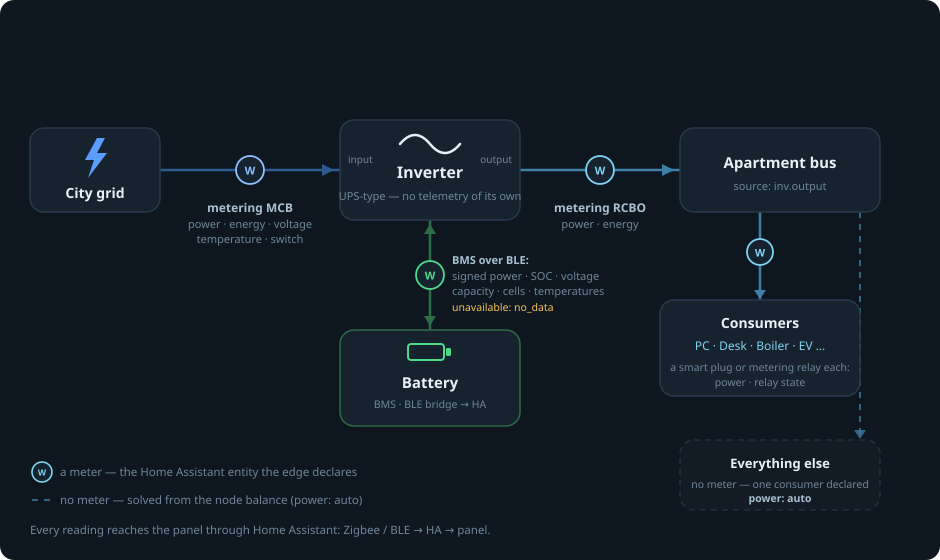

# Sensors

What the component needs from an installation, and where the readings usually
come from. Everything arrives as ordinary Home Assistant entities — the
component subscribes to them itself.

## The minimum

- **Per measured edge** — one power entity in watts. One edge per node may be
  declared `power: auto` and solved from the node balance instead of measured.
  Optional on any line: an energy counter (kWh) and the state of the breaker
  that interrupts it.
- **Battery node** — SOC (%), voltage (V), remaining capacity (Ah), and a
  signed power reading: **+ charging, − discharging**. Everything else on the
  battery screen (cells, temperatures, cycles…) is optional. For a JK BMS,
  [syssi/esphome-jk-bms](https://github.com/syssi/esphome-jk-bms) exposes all
  of it to Home Assistant.
- Publish-on-change is fine. The component time-averages over a window, so
  meters that report every few seconds and meters that only report past a
  change threshold both work; a reading does not have to be periodic.

## How the meters must sit

- A meter measures **one edge of the graph** and is declared on the terminal
  where it physically sits: grid → inverter input, inverter output → bus,
  each consumer on its own plug or breaker.
- A breaker's `switch:` belongs to **the line it interrupts**, not to the
  source behind it: opening the inverter's input breaker does not remove the
  city grid.
- By default an `unavailable` entity means the line is dead — which is true
  exactly when the meter is powered from the line it measures. A reading that
  comes through a telemetry bridge (a BLE gateway in front of a BMS) must
  declare `unavailable: no_data`, or a dropped bridge will be drawn as an
  outage.

## A typical set — this installation

A UPS-style inverter with no telemetry of its own, so every reading is
external:

Any Home Assistant–supported metering MCB / RCBO / relay / plug works; the
component only sees entities.

| Where | Hardware | Provides |
|---|---|---|
| inverter input | metering MCB (DIN breaker-meter) | power, energy, voltage, switch, temperature (if the meter has it) |
| inverter output | metering RCBO | power, energy |
| battery | the BMS, exposed to HA over a BLE bridge | signed power, SOC, voltage, capacity, cells, temperatures |
| consumers | smart plugs and metering relays | power, relay state |
| everything else | — | one consumer declared `power: auto` |

## Hybrid inverters — Deye and similar

A hybrid inverter's Home Assistant integration already exposes nearly every
reading the diagram needs: grid input, output, battery and PV power come
built in, and the whole inverter node maps onto entities you already have —
no DIN meters required. What remains is the consumer side: add a smart plug
or metering breaker for each load you want as its own card, and leave the
rest to the one `power: auto` remainder.
